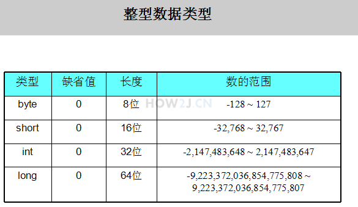
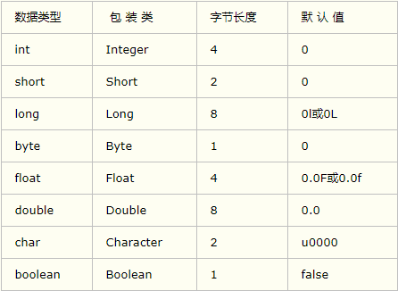
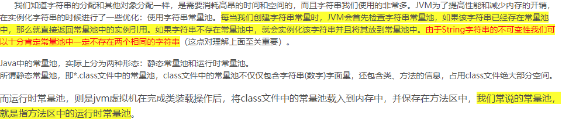
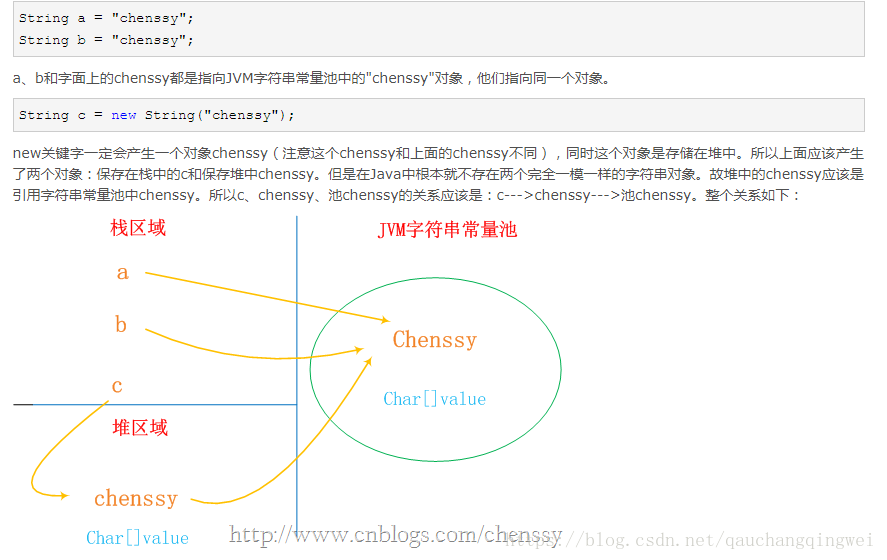
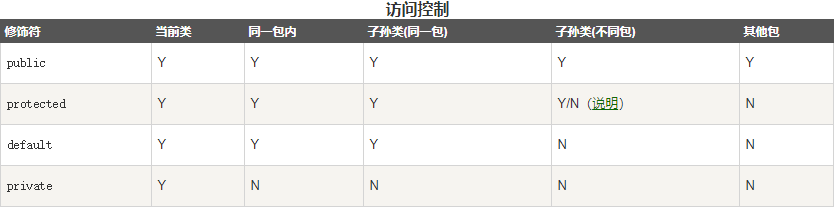
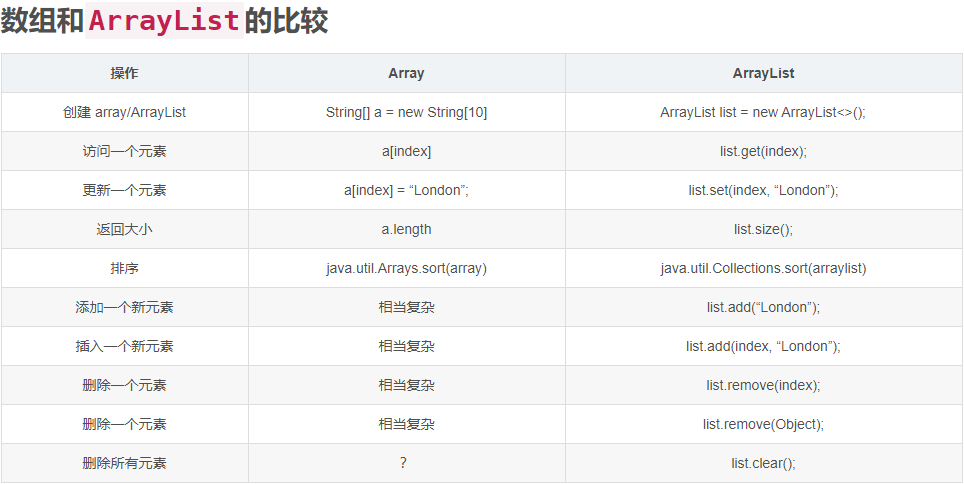
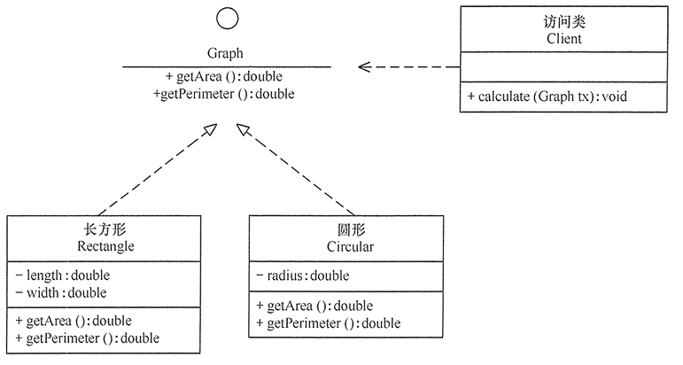
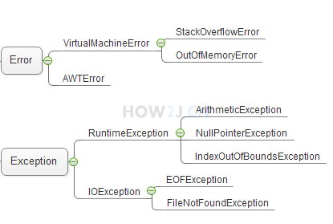

# **JAVA学习笔记**

## 下载安装：
>下载地址:https://www.oracle.com/technetwork/java/javase/downloads/jdk8-downloads-2133151.html
配置环境变量：http://www.runoob.com/java/java-environment-setup.html#linux-install（注意在windows10中不能使用JAVA_HONE，要用绝对路径;详情参考： https://www.cnblogs.com/weedboy/p/6920378.html）
当java、javac都能运行时证明安装成功;

## 编译运行：
>(https://www.cnblogs.com/wangpei/p/7084341.html)
javac <需要编译的文件> ：编译文件
javac *.java ：编译当前目录下的所有的文件文件
javac -d <新路径> <需要编译的文件> ：编译后的文件保存至新的文件夹;
java <编译后的文件名> <参数> ：运行class文件，可以在文件明后面添加参数;
java -cp <新路径> <文件名> ：运行非当前目录下的文件;

## 编码规范：
>类的首字母大写，java没有强制规定，为了增加规范性、可读性而做的一种约定;
Java是大小写敏感的;
类的名称需要与文件名完全一致;对于所有的类来说，类名的首字母应该大写。如果类名由若干单词组成，那么每个单词的首字母应该大写;
所有的Java 程序由public static void main(String []args)方法开始执行。
### Java的执行为什么一定是从main方法开始的?
> 所谓的main其实同样是作为一个标记而已，就好比汇编的伪指令，这里一定要写成main方法 是因为编译器默认会去把他作为程序执行的入口，这是约定俗成的一件事，
当然你要是有能力 也可以找到编译器的源码，找到这个标记 把他改成你自己的。
  我们知道jvm的内存模型运行时的数据区 有三大块 常量池，堆，栈。常量池存放所有已加载类的元数据（数据表的表名），堆里面存放的是类实例（表记录）。
在java里面，static修饰的方法和属性是可以在不需要实例化的时候就可以去访问的，并且我们知道static方法内部只可以使用该类static属性，而相对的实例属性 
必须要在类实例化以后才可以访问，因为只有在实例化以后，对应的类才可以在堆上有自己可以访问的数据（表里面有了记录，不在是空表），说的在朴实点就是，元数据的
所对应的指针不为空（这也是为什么static方法不能访问非static属性的原因，因为指针为空，没有对应的数据）。所以static修饰的方法或者属性，天生自带关联的内
存区域，而实例的没有，所以java在启动的时候直接去找对应的内存就可以了，不然还要重新申请内存，初始化。
*****
## 基本语法：（http://www.runoob.com/java/java-basic-syntax.html）
> ### System.out.println("") 向控制台输出数据;
> ### System.out.printf("") 向控制台输出数据;
> ### 使用System.currentTimeMillis() 获取当前时间(毫秒);
> ### Java表达式与块：
>> 以;结尾的一段代码，即为一个表达式,`;`也是一个完整的表达式;
  从{ 开始 到对应的} 结束，即一个块;
>>> 静态代码块 随类加载有且只进行一次,作用:给类进行初始化,表达形式:static{执行语句;};
> ### Java标识符：
>>所有的标识符都应该以字母（A-Z或者a-z）,美元符（$）、或者下划线（_）开始;
  首字符之后可以是字母（A-Z或者a-z）,美元符（$）、下划线（_）或数字的任何字符组合;
  关键字不能用作标识符,但可以包含关键字;标识符是大小写敏感的;
> ### Java变量以及基本变量类型:
>>Java中有八种基本类型，都是Java语言预先定义好的，并且是关键字。 这八种基本类型分别是: 
>> #### 整型 （4种：byte, short, int, long）;
>>>
  运算时要防止溢出发生,int a = 2147483647; //int类型整数的上限 System.out.println("a=" + (a+1)); //输出结果： a=-2147483648 溢出，结果错误。
>> #### 浮点型（2种）:
>>> float 长度为32位(加上点有效数字8位，即小数点后第七位将产生四舍五入;定义时要声明在赋值后面加f或者（float）转换);
  double 长度为64位 (有效数字16位;默认类型;可以以d或者D结尾);
  浮点数还可以用E或者e表示（科学计数法）e2表示10的二次方，即100;列:1.234e2 = 1.234x100;
>>#### 布尔型（1种）;boolean;
>>#### 字符型 （char）用于存放一个字符，值用单引号'表示，超过一个字符会编译错误;
>>#### 所有的基本类型，都有对应的类类型 ,这种类就叫做封装类(Byte,Short,Integer,Long,Float,Double,Boolean,Char):
>>> 
  **Number类**: 所有数字封装类(整型和浮点型)的抽象父类;
  **基本类型转封装类**: `Integer it = new Integer(i)`;
  **封装类转基本类型**: `int i2 = it.intValue();`;
  **自动装箱与自动拆箱**: 不需要调用构造方法，通过=符号自动把 基本类型 转换为 类类型 就叫装箱，例：`Integer it = i;`;不同类型**装箱**需要先转换类型，**拆箱**低精度可以直接直接复值为高精度；
  **数字的最大值，最小值**: 可以通过其对应的 封装类.MAX_VALUE 获取；
  **封装类比较**: 相同类可以通过 == 号进行值的比较，不同类不能进行比较；
  **字符串转数字**: 调用Integer的静态方法parseInt `String str = "999";int i= Integer.parseInt(str);`
  **数字转字符串**: 方法1： 使用String类的静态方法valueOf `String str = String.valueOf(i);`；方法2： 先把基本类型装箱为对象，然后调用对象的toString`Integer it = i;String str2 = it.toString();`
>> #### String类型
>>>这不是基本类型而是是一个类，即JAVA中所有见到的字符串都是对象;
  字符串格式化 
`//%s表示字符串，%d表示数字,%n表示换行
String sentenceFormat ="%s 在进行了连续 %d 次击杀后，获得了 %s 的称号%n";
String sentence2 = String.format(sentenceFormat, name,kill,title);`
>> #### String类型扩展：
>>>>##### 1.String和char的区别：
>>>>>**a**.char单引号标记且只能存一个字符，string双引号标记可寻多个字符;
  **b**.char在Java中是16位的，因为Java用的是Unicode;
>>>>> ###### **c**. String类型特征：
>>>>>> 
>>>>>> 
**C1**.String类型比较值最好用 `str1.equals(str2)`这样比较的是值（引用的数据类型对其进行了重写,用于比较值,无法作用与非对象）,而`==`比较的是指向堆区的地址（只相对于引用(例如String、Integer等)类型,对于基本类型还是比较值）; 
>>>>>> **C2**.String类是final类，也即意味着String类不能被继承，并且它的成员方法都默认为final方法。**String对象一旦被创建就是固定不变的了，对String对象的任何改变都不影响到原对象，相关的任何change操作都会生成新的对象;**
  **C3**.每当我们创建字符串常量时，JVM会首先检查字符串常量池，如果该字符串已经存在常量池中，那么就直接返回常量池中的实例引用。如果字符串不存在常量池中，就会实例化该字符串并且将其放到常量池中。**由于String字符串的不可变性我们可以十分肯定常量池中一定不存在两个相同的字符串**;
  **C4**.`str = new String("kvill"); str = str.intern()`; //把常量池中"kvill"的引用赋给str;
  **C5**.`str = new String("kvill"); start = "ll"; str.startsWith(start)`; //以...开始
  **C6**.`str = new String("kvill"); start = "ll"; str.endsWith (start)`; //以...结束
>>>>##### 2.类型转换:(地址https://www.cnblogs.com/rrttp/p/7922202.html);
>>>>>>###### 数据精度转换:
>>>>>>> 自动转换就是直接复值;强制转换则需要加上(转换后的类型),强制转化如果值超过转化后的范围那么会有数据损失(内容溢出，超过部分的数据被丢弃);
  short a = 1;short b = 2;short c = a+b会报错，因为计算后默认是int,需要转化后才能赋值;
  char 类型在转换时首先会转换位 int 在进行其他操作;
  多种基本类型计算时首先会转换为精度最高的类型，然后在进行计算;
  double类型转int型时舍弃小数部分;但是整数部分大于127小数部分为大于或等于14位9的数时，转换为整数时会加一;
>>>>>>>  
>>>>>>###### String转换为char
>>>>>>> **a**. 使用String.charAt(index)（返回值为char）可以得到String中某一指定位置的char。  列："JAVA".charAt(0);返回值为char类型，值为J;
  **b**. 使用String.toCharArray()（返回值为char[]）可以得到将包含整个String的char数组。 列："JAVA".toCharArray();返回值为char[]类型;
>>>>>>###### char转换为String 将char转换为String大致有6种方法。总结如下：
>>>>>>> a. String s = String.valueOf('c'); //效率最高的方法
 b. String s = String.valueOf(new char[]{'c'}); //将一个char数组转换成String
 c. String s = Character.toString('c');
 // Character.toString(char)方法实际上直接返回String.valueOf(char)
 d. String s = new Character('c').toString();
 e. String s = "" + 'c';
 // 虽然这个方法很简单，但这是效率最低的方法
 // Java中的String Object的值实际上是不可变的，是一个final的变量。
 // 所以我们每次对String做出任何改变，都是初始化了一个全新的String Object并将原来的变量指向了这个新String。
 // 而Java对使用+运算符处理String相加进行了方法重载。
 // 字符串直接相加连接实际上调用了如下方法：
 // new StringBuilder().a
 f. String s = new String(new char[]{'c'});
>>>>>>###### StringBuffer，变长的字符串：
>>>>>>> 长度(length())、容量(capacity): StringBuffer和String内部是一个字符数组一样，StringBuffer也维护了一个字符数组但是，这个字符数组，
留有冗余长度。比如说new StringBuffer("the")，其内部的字符数组的长度，是19(不同的JDK数量是不一样的)，而不是3，这样调用插入和追加，在现成的数组的基础上就可以完成了。
  append追加 , delete 删除 , insert 插入 , reverse 反转; **大量操作字符串时，StringBuffer效率更高**；
> ### Java泛类型:
>> 泛型是Java SE 1.5的新特性，泛型的本质是参数化类型，也就是说所操作的数据类型被指定为一个参数。这种参数类型可以用在类、接口和方法的创建中，分别称为泛型类、泛型接口、泛型方法;
>> #### **泛型类**: 
>>> 例`public class Generic<E extends Object[,U...],G,M> extends GenericParent<G> implements MyInterface<M> {}`；
   `E extends` 后面可以写任意**类**，意为类型必须为该类或其子类；如果继承的父类和实现的接口有泛类那么继承时也要一起写过来；
>> **泛型接口**: 例`public interface Generic<E extends Object[,U...],G> extends GenericParent<G>`; 接口可以继承多个接口，规则也类一致；
  **泛型方法**: 例`public <T extends Number> void test6(T num) {}`;如果泛型类以 T 为参数那么方法中可以不用声明<T>而是直接用类的T；
  **泛型名规范**: 通常作为第一个泛型类型(T,S,U,V,A,B...), 集合元素 泛型类型(E), 映射-键 泛型类型(K), 映射-值 泛型类型(V), 数值 泛型类型(N);
> ### Java操作符：
>> #### 算数操作符:`+、-、*、/、%、++、--、=`;
>> #### 关系操作符:`==、>、>=、<、<=、!=`;
>> #### 逻辑运算符:`&&、||、!`; 返回值都是boolean类型;
>> #### 位运算符：`&、|、^、~、<<、>>、>>>`; 位运算即二进制运算,Integer.toBinaryString(i)可以得到一个整数的二进制值; 
>>> **位与&**: 二进制状态的两个数相同位置的数进行 与 比较;例:5的二进制是101,6的二进制是110,那么 5&6 = 4(100);全真才为真;
  **位或!**: 二进制状态的两个数相同位置的数进行 或 比较;例:5的二进制是101,6的二进制是110,那么 5!6 = 7(111);有真就为真;
  **异或^**: 二进制状态的两个数相同位置的数进行 异或 比较;例:5的二进制是101,6的二进制是110,那么 5^6 = 3(011);不同才为真;
  **取非~**: 二进制状态的一个数进行 取非 ;例:5的二进制是101,那么 ~5 = -6(11111010,int型长度共32位,前面可用1填充);
  **左移<<**: 二进制状态的一个数进行 左移 ;例:6的二进制是110,那么 6>>1 = 12(1100);
  **右移>>**: 二进制状态的一个数进行 右移 ;例:6的二进制是110,那么 6<<1 = 3(11);
  **无符号右移>>>**: 当运算的数字为正时等效于 >>,否则右移后高位补0;例:-20的二进制为11111111111111111111111111101100,-20>>2=1073741819(00111111111111111111111111111011);
  int i = 1;boolean b = !(i++ == 3) ^ (i++ ==2) && (i++==3);System.out.println(b);System.out.println(i); 输出:false,3;
>> #### 赋值操作符:`+=、-=、*=、/=、%=、&=、!=、^=、<<=、>>=、>>>=`;
>> #### 三元操作符:`?:`;
>>>  
> ### Java修饰符:
>> #### 访问控制修饰符 : default(friendly), public , protected, private(作用范围最小原则)
>>> default(friendly/package)：默认权限也称作包（package）访问权限，即只能在同一个包下访问;使用对象：类、接口、变量、方法;
  public：对所有类可见。使用对象：类、接口、变量、方法;
  private：在同一类内可见;使用对象：变量、方法。 注意：不能修饰类（外部类）;
  protected：对同一包内的类和所有子类可见;使用对象：变量、方法。注意：不能修饰类（外部类）;
   
>> #### 非访问控制修饰符 : static, final, abstract, synchronized, volatile
>>> ##### static:静态(属性、方法)
>>>> static变量: 用来声明独立于对象的静态变量;无论一个类实例化多少对象，它的静态变量只有一份拷贝;静态变量也被称为类变量。局部变量不能被声明为 static 变量;
  static方法: 用来声明独立于对象的静态方法。静态方法不能使用类的非静态变量。静态方法从参数列表得到数据，然后计算这些数据;不需要对象的存在，直接就访问;
>>> ##### final:最后(属性、方法、类)
>>>> final变量/引用: 可以也只可以赋值一次，变量一旦赋值后，不能被重新赋值;`public static final type name` 定义常量;
  final方法: 可以被子类继承，但是不能被子类修改;
  final变量: 类不能被继承;
>>> ##### abstract :抽象(方法、类)
>>>> abstract方法: 是一种没有任何实现的方法，该方法的的具体实现由子类提供;任何继承抽象类的子类必须实现父类的所有抽象方法，除非该子类也是抽象类。如果一个类包含若干个抽象方法，那么该类必须声明为抽象类。抽象类可以不包含抽象方法。抽象方法的声明以分号结尾，例如：public abstract sample();
  abstract变量: 抽象类不能用来实例化对象，声明抽象类的唯一目的是为了将来对该类进行扩充;如果一个类包含抽象方法，那么该类一定要声明为抽象类，否则将出现编译错误;抽象类可以包含抽象方法和非抽象方法;
<be /> abstract类不能喝final同时修饰，abstract方法不能与final或static同时修饰;
>>> ##### synchronized、volatile:
>>>> synchronized方法: 同一时间只能被一个线程访问。synchronized 修饰符可以应用于四个访问修饰符;
  volatile变量: 每次被线程访问时，都强制从共享内存中重新读取该成员变量的值; 当成员变量发生变化时，会强制线程将变化值回写到共享内存;
> ### Java流程控制：
>> if 内部如果只有一个表达式可以不用写括弧，看上去会简约一些;
  switch 中 case 可以堆叠(没写 break 时继续执行下一个case的内容直到遇到break为止);
  while 与 do while: do while 先运行再判断，所以无论如何都会运行一次; while 先判断再运行;
  for 表达式一(做n次循环,第二个表达式可以省略为无限循环): `for(int i = 0; i < n; i++){}`; 表达式二(做数组遍历): `for(int x : number){}`;
  continue: 结束本次循环进入下一循环;
  break: 跳出循环; 跳出多重循环: 
  outloop这个标示是可以自定义的比如outloop1,ol2,out5
  `outloop:for (int i = 0; i < 10; i++) {
    for (int j = 0; j < 10; j++) {
        System.out.println(i+":"+j);
            if(0==j%2) break outloop; //如果是双数，结束外部循环
    }
}`
> ### Java数组：
>> #### 声明数组：int[] a;
>>> `typeName(类型名)[] arrayName(数组名)`; 声明了一个数组变量;
  声明，不会创建数组; 数组必须声明类型，且之后数组只能存放该类型数据;
>> #### 创建数组：new int[5];
>>>` new 数组类型[数组长度]` ; 创建一个数组;
  如果变量代表一个数组，比如a,我们把a叫做引用;
  如果数组没有赋值，那么必须规定数组的长度，并且会使用默认值;数组的长度是不可变的;
>> #### 数组通过下标来访问数据，下标从0开始;
>> #### 数组.length属性用于访问一个数组的长度，超过长度的访问就会产生数组下标越界异常;
>> #### 数组.分配空间与时赋值：
>>> 分配空间与赋值分步进行: `int[] a = new int[5];a[0] = 100;` ;
  分配空间，同时赋值: 
  `int[] a = new int[]{100,102,444,836,3236};` ;
  `int[] b = {100,102,444,836,3236};` ;
>> #### 复制数组：System.arraycopy(arr1, 被复制的数组的起始位置, arr2, 新数组的内容存放起始位置, 复制长度)；数组类型要一致，并且arr2.length>arr1。length;
>> #### 多维数组：
>>> 声明：`int[][] a`;  分配空间：`new int[2][3]`; //有两个一维数组，每个一维数组的长度是3; 访问数组：`a[1][2] = 5`;  //可以直接访问一维数组，因为已经分配了空间;
  分配空间，同时赋值: `int[][] c = new int[][]{ {1,2,4},{4,5},{6,7,8,9} }`;
>> ### Arrays类：
>>> copyOfRange 数组复制: `int[] b = Arrays.copyOfRange(a, 0, 3);`;
  toString(一维)、deepToString 数组字符串: `String content = Arrays.toString(a);//一维数组 String content = Arrays.deepToString(a);//多维数组`;
  sort 数组排序: `Arrays.sort(a);`;
  binarySearch 数组搜索: `int index = Arrays.binarySearch(a, 搜索的值);`; //首先需要对数组进行排序
  fill 数组填充: `Arrays.fill(a, 填充的内容);`; 
  .equals 判断是否相同: `Arrays.equals(a, b); //返回值是一个 boolean`; 比较得是数组的引用路径;
  ArrayList 数组转为普通数组：`String[] a = b.toArray(new String(b.size()))`;注意，把数组的类型要一致；
   

> ### Java类与对象：
>> Java类：类是一个模板，它描述一类对象的行为和状态;
>> #### Java Object 类：
>>> 所有类的父类，申明一个没有继承的类时默认是继承了Object;
>> Java对象：拥有类的特征的实体;
>> #### 创建(实例)对象： 
>>> 创建：`new Hero();`;仅仅是创建了一个对象，没有办法访问它为了访问这个对象;
  指向：`Hero h =`; 引用代表创建的对象“代表” 在面向对象里，又叫做“指向”;
  多个引用，一个对象: `Hero h1 = new Hero();Hero h2 = h1;`  //h2指向h1所指向的对象
  一个引用，多个对象: `Hero h1 = new Hero();h1 = new Hero();`  //对象1，就没有任何引用指向了那么该对象就变得没有意义。
>> #### 类的继承（extends）：Java只能直接继承一个父类；
>> #### 类方法
>>> 参数名和属性名一样时，在方法体中，只能访问到参数，所以在方法中参数加上 `this.name`用来表示属性(this代表当前对象);
  方法重载：同一个类里面方法名是一样的，但是参数类型(或者数量)不一样的方法，在调用方法时会根据参数自动调用对应的方法;
  可变数量参数： `public void attack(Hero... heros) { for (int i = 0; i < heros.length; i++) {}}`;
  构造方法： 与类名一致的方法（大小写，无返回值，实例化对象时调用）, 如果不写会有一个默认的构造方法写了就不会有,构造方法也支持重载,如果要在一个构造方法中，调用另一个构造方法，可以使用this()(必须写在第一行);
>> #### 类单例模式：
>>> ##### 单例模式又叫做 Singleton模式，指的是一个类，在一个JVM里，只有一个实例存在(该类只能实例化一个对象);
>>>> **单例模式三要素1. 构造方法私有化;**
  **单例模式三要素2. 静态属性指向实例;**
  **单例模式三要素3. 公共的静态`public static className getInstance()`方法返回对象;**
  饿汉式单例模式: 静态属性声明的时候实例化唯一的一个对象（外部调用之前）;
  懒汉式单例模式: 外部调用接口的时候判断唯一对象是否存在，不存在才实例化对象（外部调用时）;
  枚举单例模式(目前最为安全的实现单例的方法): `private enum Singleton {  INSTANCE;  public void whateverMethod() {  }};`;
>> #### 类属性：
>>> 初始化方式： 1、声明对象的时候初始化； 2、静态代码块初始化;
  对象属性初始化方法：1、声明对象的时候初始化； 2、代码块初始化; 3、构造函数初始化；
>> ## Java枚举类型：枚举enum是一种特殊的类，枚举可以很方便的定义常量;
> ### Java接口与继承：
>> #### Java super关键字：
>>> **调用父类带参构造方法**: 在Java中子类构造方法会默认调用父类的 无参的构造方法，有参数的构造方法需要 super(参数) 来调用;
<be /> **调用父类属性**: super.属性名;
<be /> **调用父类方法**: super.方法名;
>> **接口是一种特殊的抽象类**
>>> **接口类（特殊抽象类）**：必须用 public interface 修饰修饰； 
  **接口的方法**： 方法修饰符必须都是 public abstract，在继承的类中所有的方法必须被实现；
  **接口的变量**： 变量修饰符必须都是 public static final(常量)，在继承的类中所有的方法必须被实现；
  **接口继承接口**： 接口可以继承多个接口，接口中如果有默认方法或抽象方法产生冲突需要在继承的接口内新定义一个方法来覆盖；
  通过 implements 继承接口，接口可以继承多个，用‘,’分隔；
>> #### Java对象转型（引用类型和对象类型不一致的情况下的转换问题）：
>>> 通常情况下，引用类型和对象类型是一样的; 例: `ADHero ad = new ADHero();` 对象 ad 的类型是 ADHero，引用的类型也是 ADHero；
  所谓的转型，是指当**引用类型**和**对象类型**不一致的时候；
>>> ##### 子类转父类(upcasting/向上转型)：
>>>> 例：`Hero h = new ADHero();//申明(引用)Hero类，指向对象为ADHero类`  对象 h 的类型是 Hero，引用的类型是 ADHero；
  子类转父类可以直接转,但是得到的引用只能使用父类的方法和属性如果在子类重写那么会使用子类的方法属性；
  作用: 减少重复代码，父类为参数，调有时用子类作为参数，就是利用了向上转型。这样使代码变得简洁。体现了JAVA的抽象编程思想；
>>> ##### 父类转子类(downcasting/向下转型)：
>>>> 例1：`Hero h = new ADHero();ADHero ad = (ADHero)h;`;
>>>> 例2：`Hero h = new Hero();ADHero ad = (ADHero)h;`;
  例1.ad对象的引用和指向一直，编译和运行都不会报错，例2编译不会报错运行时会出现`java.lang.ClassCastException`错误；
>>> ##### 没有继承关系的两个类，互相转换，一定会失败；
>>>> instanceof Hero 判断一个引用所指向的对象，是否是Hero类型，或者Hero的子类; 返回值为boolean类型;
>> #### Java类方法重写： 在继承后，重复提供该方法，就叫做方法的重写，调用时使用重写之后的方法(对象方法)；
>> #### Java类方法隐藏： 在继承后，子类覆盖父类的类方法(静态方法static)；
>> #### Java类的多态（多态是同一个行为具有多个不同表现形式或形态的能力）：
>>> **多态存在的三个必要条件**: 继承、重写、父类引用指向子类对象；
  **多态的优点**: 1. 消除类型之间的耦合关系；2. 可替换性；3. 可扩充性；4. 接口性；5. 灵活性；6. 简化性;
>> #### Java抽象类（abstract）：
>>> **Java是单继承多接口**，接口是特殊的抽象类
  有抽象方法的类必须定义为抽象类，抽象类不一定要有抽象方法；
  有抽象类与接口的区别：抽象类可以定义任意属性，接口只能定义常量（public static final）；
  接口可以定义默认方法（JDK8及之后版本）：例 `default void haha(){ System.out.println("我是个接口默认方法"); }`；如果实例的接口默认方法冲突了那么就需要在类中定义一个新的方法覆盖；
>> #### Java内部类：
>>> 内部类作为外部类的一个特殊的成员来看待（与属性、方法并列，所以可以在内部类中访问private属性、方法）；因此它有类成员的封闭等级：private ,protected,默认(friendly),public 和类成员的修饰符: static,final,abstract；
  **非静态内部类**: 语法: `new 外部类().new 内部类()`；是可以直接访问外部类的private实例属性和方法；
  **静态内部类(同样用static修饰)**: 语法: `new 外部类.静态内部类();`；静态内部类的实例化 不需要一个外部类的实例为基础，可以直接实例化；静态内部类里面不可以访问外部类的实例属性和方法（可以访问私有**类/静态**属性方法）；
  **匿名内部类**: 匿名内部类是在抽象类和接口的基础之上发展起来的(在可实例化的类中` AD a = new AD(){public void physicAttack(ADAPHero temp) {System.out.println("匿名内部类.");};a.physicAttack(null);`)。匿名内部类如果继承自接口,必须实现指定接口的方法,且无参数 。匿名内部类如果继承自类,参数必须按父类的构造函数的参数传递；
  **本地内部类(局部类，类似局部变量)**: 直接声明在代码块里面，可以是主方法，for循环里等等地方；
> ### Scanner类:(获取用户输入的的内容)
>> `import java.util.Scanner;` 导入类;
  创建对象: Scanner scanner = new Scanner(System.in);
  读取整数: int i = scanner.nextInt();
  读取浮点数: float f = scanner.nextFloat();
  读取字符串: String s = Scanner.nextLine();
  关闭Scanner类: Scanner.close(); Scanner对象只能有一个（可设为成员变量）;只能关闭一次（如果非得关闭的话）;> ### Scanner类:(获取用户输入的的内容)
> ### Java时间:(java.util.Date)
>> ### Date类:(java.util.Date)
>>> `import java.util.Scanner;` 导入类;
  创建对象:  `Date d1 = new Date(int temp)`; 从1970年1月1日 早上8点0分0秒 开始经历了temp毫秒的时间
  getTime 返回时间戳: `d1.getTime(); System.currentTimeMillis()`两个方法是一样的是一样的，不过由于机器性能的原因，可能会相差几十毫秒;
>> #### 时间格式化 SimpleDateFormat：
>>> 获取指定格式的对象： `SimpleDateFormat df = new SimpleDateFormat("yyyy-mm-dd HH:mm:ss")`;
  指定格式的时间转Date对象： `Date da = df.parse("2010-09-13 22:36:01");`;    返回值是Date对象
  指定对象返回指定格式的时间戳： `df.format(new Date(d1));`;  返回值是String类型
>> #### Calendar类（日历类）：
>>> 采用单例模式获取日历对象 `Calendar c = Calendar.getInstance()`;
  通过日历对象得到日期对象: `Date d = c.getTime()`;
  通过日期对象设置日历对象 :`Date d2 = new Date(0);    c.setTime(d2)`;
  翻日历 add()在原日期上增减年/月/日 、set()直接设置年/月/日:
  上个月第三天: `c.add(Calendar.MONTH, -1);c.set(Calendar.DATE, 3);`;
  下一年的今天: `c.add(Calendar.YEAR, 1);`;
> ### Java文件处理:
>> 创建 File 对象：`File file = new File(dest);`;
  运行文件：`new FileInputStream(file);`；
  getAbsolutePath()：返回文件的绝对路径；
  exists()：判断文件对象是否存在；
  isDirectory()：判断对象是否是文件夹；
  isFile()：判断对象是否是文件；
  lastModified()：获取文件最后修改时间；
  setLastModified()：设置最后修改时间；
  listFiles()： 以对象数组的形式，返回当前文件夹下的所有文件**对象**；
  list()： 以字符串数组的形式，返回当前文件夹下的所有文件名**字符串**；
  getParent()：以字符串的形式，返回当前目录所在的文件夹；
  getParentFile()：以对象的形式，返回当前目录所在的文件夹；
  mkdir()：创建文件夹，如果父文件夹不存在，就会创建失败；
  mkdirs()：创建文件夹，如果父文件夹不存在，就会创建父文件夹；
  createNewFile()：创建一个空文件,如果父文件夹skin不存在，就会抛出异常；
  listRoots()：列出所有的盘符，返回值是一个File[]；
  delete()：刪除文件；
  deleteOnExit()：JVM结束的时候，刪除文件，常用于临时文件的删除；
>> #### Java 文件流:(流就是一系列的数据,当不同的介质之间有数据交互的时候，JAVA就使用流来实现；数据源可以是文件，还可以是数据库，网络甚至是其他的程序)  
>>> **输入流**： InputStream，字节输入流，抽象类，FileInputStream(文件输入流)是它的子类; 
  创建基于文件的输入流: `File f = new File("e:/JAVAClass/file.txt"); FileInputStream fis = new FileInputStream(f);`以把数据从硬盘，读取到Java的虚拟机(内存)中;
  输入流对应的文件必须存在，否则报错；`byte[] arr = new byte[f.length()]; fis.read(arr);`将文件内容byte的形式存入数组;
>>> #####**输出流**：OutputStream，字节输出流，抽象类，FileOutputStream(文件输出流)是它的子类; 
>>>> 创建基于文件的输出流: `FileOutputStream fos = new FileOutputStream(f , true)`; 第二个参数设为true，表示追加内容，否则替换原有内容;
  把数据写入到输出流: `fos.write(data)`;  注意:data的类型只可以是 int、short、byte、byte[], getBytes()方法可以将字符串转化为byte[], "\r\n"可用于换行;
  输出流对应的文件如果不存在会自动创建一个；
>>> ##### 关闭流
>>>> 所有的流，无论是输入流还是输出流，使用完毕之后，都应该关闭。 如果不关闭，会产生对资源占用的浪费;
  方法一：在try中关闭，如果文件不存在，或者读取的时候出现问题而抛出异常，那么就不会执行这一行关闭流的代码，存在巨大的资源占用隐患;
  方法二：在finally中关闭，1. 首先把流的引用声明在try的外面，如果声明在try里面，其作用域无法抵达finally；2. 在finally关闭之前，要先判断
该引用是否为空；3. 关闭的时候，需要再一次进行try catch处理，标准但是很繁琐；
  方法三：把流定义在try()里,try,catch或者finally结束的时候，会自动关闭；这种编写代码的方式叫做 try-with-resources， 这是从JDK7开始支持的技术；

> ### Java UML图:（可见性：+、#、~、-）
>> 层次：上层是类名，中层是属性名，下层是方法名;
  可见性(访问权限控制)：公有(public:+)、私有(private:-)，友好的（friendly/package:~)和受保护(protected:#);
  方法的参数和返回值：在方法括号内的是参数(可以是多个，用逗号隔开)，括号外的是返回值;
  带下划线的是构造方法，斜体子是抽象（方法，属性、类）;
  接口规则与普通类一致，但是接口的类带有**圆圈**，且只有两层（类名、抽象方法）;
>> #### UNL图之间的关系:（依赖、关联、聚合、组合、泛华/继承、实现）
>>> 依赖关系:虚线箭头表示
>>> ##### 关联关系:
>>>> 单向关联关系: 单向箭头连接两个类，箭头上的数字代表他们之间关系的数量（0...*表示0或多个对象有关系）；
  双向关联关系: 双向箭头连接两个类，箭头上的数字代表他们之间关系的数量（0...*表示0或多个对象有关系）；
>>> 聚合关系: **聚合关系用带空心菱形的直线表示**,表示整体与部分的关系。在聚合关系中，成员对象是整体对象的一部分，但是成员对象可以脱离整体对象独立存在;
   组合关系: **组合关系用带实心菱形的直线表示**,表示整体与部分的关系。表示类之间整体和部分的关系，但是在组合关系中整体对象可以控制成员对象的生命周期，
一旦整体对象不存在，成员对象也将不存在，成员对象与整体对象之间具有同生共死的关系;
  **泛化(继承)关系**: **泛化关系用带空心三角形的实线来表示**,用于描述父类与子类之间的关系，父类又称作基类或超类，子类又称作派生类;
  **实现关系**: **实现关系用带空心三角形的虚线来表示**,用于描述类与接口之间的关系;
   

> ### Java异常处理:（导致程序的正常流程被中断的事件，叫做异常,总体上异常分三类：1错误; 2.运行时异常; 3.可查异常)
>> #### 异常处理常见手段：(try catch finally throws throw)
>>> try catch 异常处理: `try{ 正确时运行 }catch(Exception e){ e.printStackTrace(); }`;
  finally : 无论是否出现异常，finally中的代码都会被执行`finally{ System.out.println("无论文件是否存在， 都会执行的代码");}`;,快内不应该带有返回值，否则try catch的返回都会被覆盖；
>>> ##### throw和throws的区别：(抛出了异常，谁调用，谁处理；注意在处理抛出异常时的对象要与对象的类一致)
>>>> throws 出现在方法声明上，而throw通常都出现在方法体内。
  throws 表示出现异常的一种可能性，并不一定会发生这些异常；throw则是抛出了异常，执行throw则一定抛出了某个异常对象。
  实现的抽象方法抛出错误时，被继承的方法也要抛出错误；
>> #### 错误Error：
>>> 错误Error，指的是系统级别的异常，通常是内存用光了;
  Error类和Exception类都是Throwable的子类，**Error类不能够被捕捉**，Error类的子类有StackOverflowError类和OutOfMemoryError类；
  Exception(运行时异常)类可以用try catch捕捉，Exception类的子类有RuntimeException类（不强制要求用try catch捕捉，但是要这么做也可以）;
  其他类(可查异常)（这些类被称为checked exception，是必须要用try catch捕捉的类，否则编译器不通过）;
>> 

